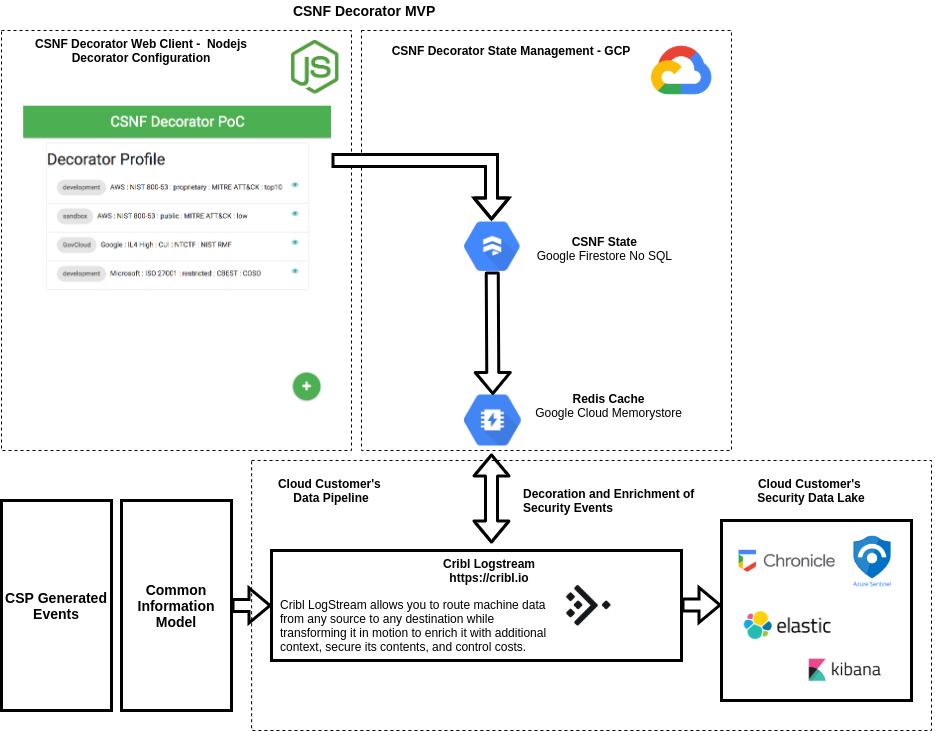
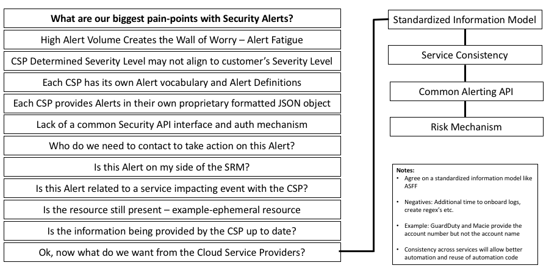
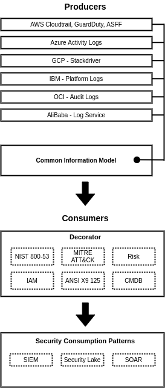
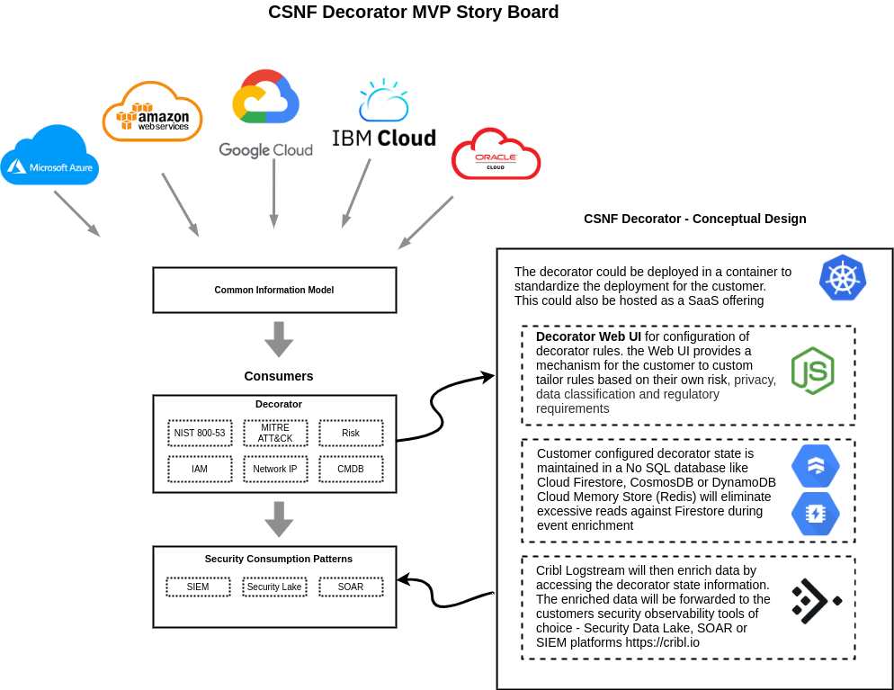

# 1. CSNF Decorator MVP - README

<!-- TOC -->autoauto- [1. CSNF Decorator MVP - README](#1-csnf-decorator-mvp---readme)auto    - [1.1. CSNF Overview (borrowed from the one-pager)](#11-csnf-overview-borrowed-from-the-one-pager)auto    - [1.2. Multi-Cloud Security Pain Points](#12-multi-cloud-security-pain-points)auto    - [1.3. Multi-Cloud Security Events and the need for a Common Information Model](#13-multi-cloud-security-events-and-the-need-for-a-common-information-model)auto    - [1.4. CSNF Decorator - Design Concept](#14-csnf-decorator---design-concept)auto    - [1.5. CSNF Decorator - Implementation Concept](#15-csnf-decorator---implementation-concept)auto        - [1.5.1. ](#151-csnf-decorator-designarchimgcsnf-decorator-designpng)autoauto<!-- /TOC -->

## 1.1. CSNF Overview (borrowed from the one-pager)

**Objectives and Goals:** These learnings aggregated requirements and culminated into a construct and context for the CSNF “decorator.” Below is an abbreviated list of objectives and goals.

A CSNF architecture and consumption model has been developed with the objective to communicate architectural components of the framework along with today’s friction, the goal of a common information model, the role of the open decorator and decorated alert consumption. 

**Desired Outcome**: The CSNF decorator outcome will provide the ability to interpret or interrogate security events/alerts/alarms, etc., across various CSP logs using common standards such as NIST, Mitre ATT&CK, etc. An operator or system may consume CSP logs through the lens of these standards which deliver the same consistent answer/output independent of CSP source. In addition, a collection of additional vetted meta fields that include additional content, which can be vetted along with the log such as an alert with a resource ID, display name, etc. The CC could curate a collection of content that it may want vetted to assist it in building its controls. These attributes become highly beneficial to prioritize incident response as well as reduce the amount of times a CC may need to query a CSP(s) to collect needed data.  

**Next Steps**: With the CC providing aggregate requirements, the next step is to move into a building phase where the CSPs offer a proposal to collaborate and develop the decorator as suggested during a previous working group session. This will provide a focus and the organizing principle for the CC to further aggregate requirements into the decorator. CSPs will develop a plan and prototype to be presented during the Tuesday check-in meetings where CCs can provide input and guidance on progress to assure the decorator is well received by the community and industry at large. As a goal, a minimum (slice of functionality) demonstration of the decorator operating within an end-to-end solution to showcase its value and promise is to be presented at ONUG Spring on May 5th and 6th with a more robust demonstration at ONUG Fall on October 20th and 21st.  CCs will test via Proof of Concept the decorator within their security data lakes, providing additional engineering input to CSPs and be publicly communicate findings via the ONUG collaborative.  For committed companies and further information on the ONUG collaborative please go [here](https://onug.net/collaborative/).  

## 1.2. Multi-Cloud Security Pain Points

As more organizations are shifting infrastructure and services to the cloud, more are adopting a multi-cloud strategy.

But for all the benefits of a multi-cloud strategy, there are some challenges that come with it as well. As the volume of information increases so does the noise and alert fatigue begins to set in. Cloud customers need a new way to address the ever increasing volume of security events in an attempt to bring order to the chaos. 

## 1.3. Multi-Cloud Security Events and the need for a Common Information Model

## 1.4. CSNF Decorator - Design Concept

## 1.5. CSNF Decorator - Implementation Concept

### 1.5.1. 